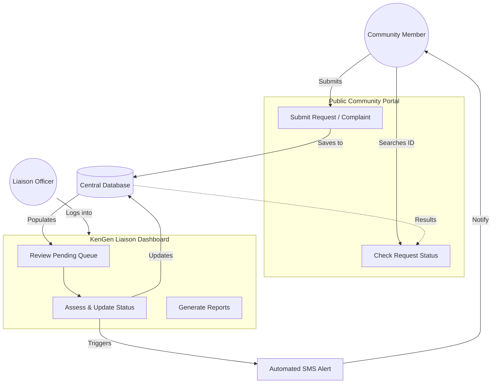
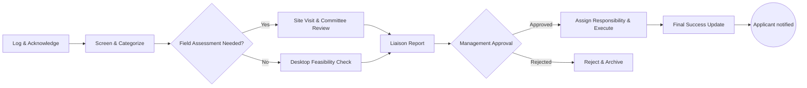

# KenGen Liaison Portal ⚡

A modern, streamlined community engagement platform designed for **KenGen** (Kenya Electricity Generating Company) to manage, track, and resolve community requests and complaints efficiently.

 *(Note: Placeholder for actual banner)*

## 📖 About the Project

The KenGen Liaison Portal serves as a digital bridge between KenGen and its host communities. It replaces manual, paper-based request tracking with a robust digital workflow, ensuring every community voice is heard and every request is processed with transparency.

### Core Objectives
- **Accessibility**: Provide a simple way for community members to submit requests via a public portal.
- **Transparency**: Enable real-time tracking of request status via unique IDs and SMS alerts.
- **Efficiency**: Streamline the internal assessment and approval process for KenGen Liaison Officers.
- **Data-Driven**: Centralize community interaction data for better CSR reporting and decision-making.

---

## ✨ Key Features

### 🏢 Community Portal
- **Multi-Category Submissions**: Dedicated forms for:
  - **Projects**: School toilets, church support, etc.
  - **Water (Maji)**: Requests for bulk water delivery with volume and transport details.
  - **Complaints**: A structured way to report issues with urgency levels.
- **Status Tracking**: Search functionality using a unique Request ID to see progress in real-time.
- **Mobile-First Design**: Optimized for access from smartphones in the field.

### 🛠️ Internal Admin Dashboard
- **Request Queue**: A centralized view for Liaison Officers to review pending submissions.
- **Assessment Workflow**: Integrated steps for field visits, feasibility reports, and department reviews.
- **Status Management**: Update requests from "Pending" to "Review", "Approved", or "Completed".
- **Automated Notifications**: Triggers SMS alerts to community members upon status changes.

---

## 🏗️ System Architecture

The following flowcharts illustrate the high-level logic of the portal:

### 1. System Overview


### 2. Internal Processing Workflow


---

## 🚀 Tech Stack

- **Frontend**: HTML5, Tailwind CSS
- **Icons**: [Lucide Icons](https://lucide.dev/)
- **Typography**: Sora & Space Mono (Google Fonts)
- **Diagrams**: Mermaid.js
- **Logic**: Vanilla JavaScript (ES6+)

---

## 🛠️ Getting Started

Since this is a frontend-focused implementation, you can preview the portal by opening the HTML files in any modern browser.

1. **Clone the repository**:
   ```bash
   git clone git@github.com:mathewekuwam/kengen-liaison-portal.git
   ```
2. **Open the landing page**:
   - For the public side, open `kengen-community.html`.
   - For the staff side, open `kengen-auth.html` (Use any demo credentials to login).

---

## 📂 Project Structure

- `kengen-community.html`: The public portal for community submissions.
- `kengen-auth.html`: Staff login and registration page.
- `kengen-dashboard.html`: Internal management dashboard.
- `liaison-system-flowcharts.md`: Technical documentation of system flows.
- `community-request-workflow.md`: Detailed processing steps.

---

## 📝 License

Distributed under the MIT License. See `LICENSE` for more information.

---

**Developed for KenGen Liaison Department.**  
*Empowering communities through transparent engagement.*
