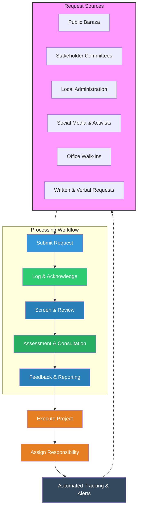

# Community Request Processing Workflow

This document provides a detailed breakdown of the community request processing system as extracted from the provided workflow diagram.

## 1. Request Sources
Requests originate from several key community entry points:
- **Public Baraza**: Community meetings.
- **Stakeholder Committees**: Represented groups.
- **Local Administration**: Government or administrative offices.
- **Social Media & Activists**: Digital and advocacy-driven requests.
- **Office Walk-Ins**: Direct visitation.
- **Written & Verbal Requests**: Traditional submissions.

---

## 2. The Processing Pipeline

### Stage 1: Submit Request
- **Inputs**: Paper Forms, Emails, Social Media, Verbal Requests.
- **Action**: Initial capture of the community need.

### Stage 2: Log & Acknowledge
- **Action 1**: Register the request in the central database.
- **Action 2**: Send an official acknowledgement to the requester.

### Stage 3: Screen & Review
- **Action 1**: Conduct an initial assessment of the request.
- **Action 2**: Categorize the request for appropriate routing.

### Stage 4: Assessment & Consultation
- **Action 1**: Field visits and committee reviews.
- **Action 2**: Comprehensive needs evaluation.

### Stage 5: Feedback & Reporting
- **Action 1**: Analyze budget and feasibility.
- **Action 2**: Obtain final management approval.

---

## 3. Implementation & Monitoring

### Execution Phase
- **Execute Project**: Implementation of the approved request.
- **Assign Responsibility**: Defining roles for delivery.

### Automated Tracking & Alerts
The system provides a feedback loop that informs the original request sources via:
- **Real-Time Updates**
- **Status Notifications**

---

## 4. Flowchart (Mermaid)

