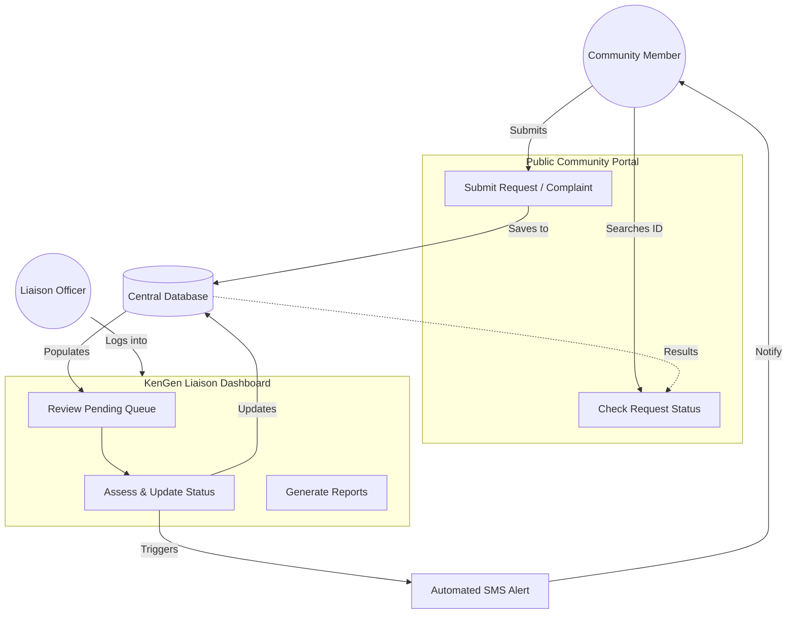
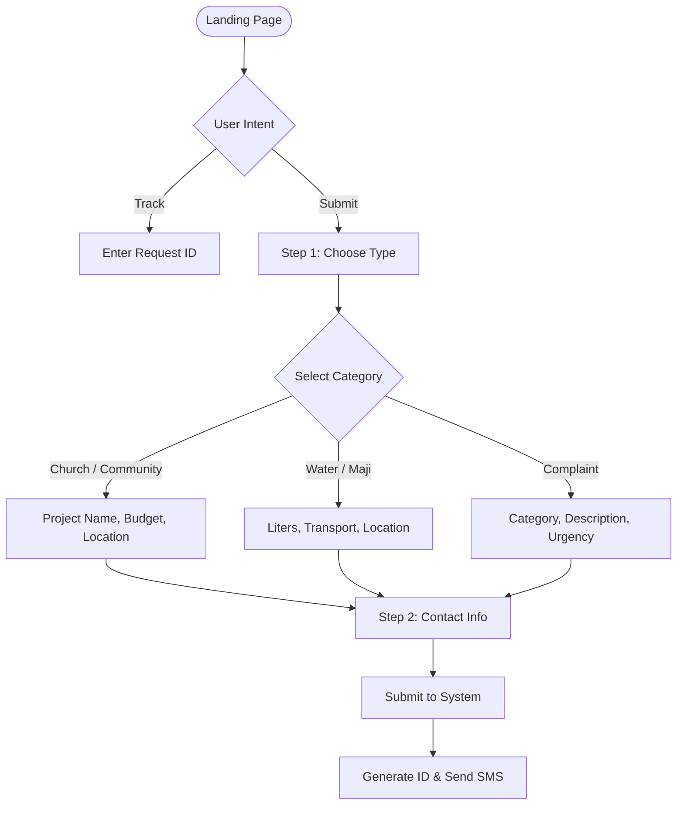
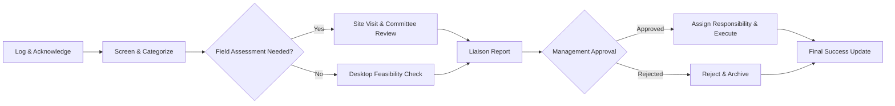
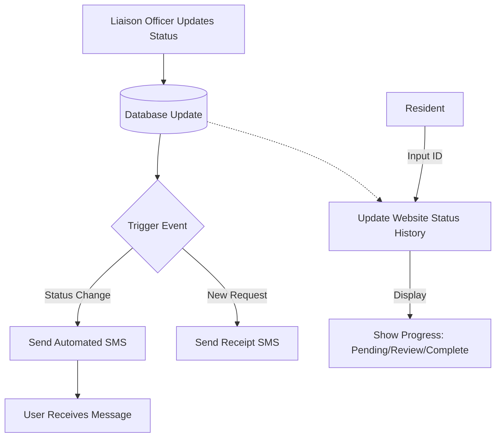

# KenGen Liaison System Flowcharts

This document outlines the operational and technical flows of the KenGen Liaison system, bridging the Community Portal and the Admin Dashboard.

---

## 1. System-Wide Overview
This flowchart demonstrates the high-level interaction between community members and the Liaison team.

---

## 2. Community Submission Flow
Detailed logic for how the website handles different types of requests (Project vs. Water vs. Complaint).

---

## 3. Liaison Processing Workflow (Internal)
The steps taken by KenGen staff after receiving a request, derived from the organizational workflow.

---

## 4. Notification & Status Loop
How the system ensures transparency and keeps the community informed.

